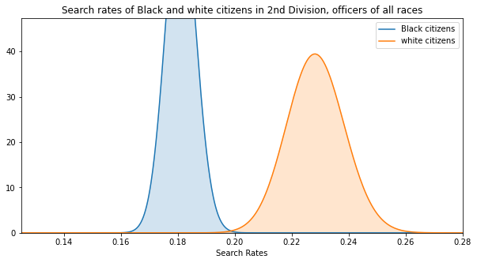

# The role of race in Louisville traffic stop searches
&nbsp;
&nbsp;

&nbsp;
&nbsp;
## Introduction: 

* The issue of race and policing dominated headlines in the U.S. last year. I examined a dataset from the Stanford Open Policing Project that contains several years' of police traffic stops in Louisville, Kentucky, where the police shooting of Breonna Taylor in March was a factor in sparking nationwide protests. My objective was to determine whether race played a role in the outcomes of traffic stops in Louisville. I was particularly interested in searches, which mark a more aggressive and invasive stance by an officer and inherently involve questions of civil rights.  

&nbsp;
&nbsp;
## The data: 

https://openpolicing.stanford.edu/data/

The dataset contained details on more than 100,000 traffic stops over three years. 

Features included:

* Age, race and gender of people stopped 
* Age, race and gender of police officers who stopped them
* Location (latitude and longitude) of the stop
* Police division where the stop occurred
* The stated reason for the stop
* Whether the citizen was searched, frisked, given a citation

&nbsp;
&nbsp;
## Among the questions asked and answered:

* Do Black citizens face a higher probability of being searched than white citizens?  

* Are white officers or Black officers more likely to search a Black citizen?
    
* Are Black officers more likely to search a Black citizen or a white one?

* Are Latino officers more likely to search someone than a white officer?

&nbsp;
&nbsp;
&nbsp;
&nbsp;
## An overview of stops, searches and citations by race of citizens
* Blacks are overrepresented as a percentage of the population in stops, searches and citations.

* Whites, Latinos and Asians are underrepresented.

&nbsp;
&nbsp;
&nbsp;
&nbsp;

&nbsp;
&nbsp;

* The percentage of Black motorists who were searched was nearly double that of whites. 

* But white and Latino citizens were given citations at a higher rate.

&nbsp;
&nbsp;

&nbsp;
&nbsp;
&nbsp;
&nbsp;
### The probabilities of Black and white citizens being searched
* In 10,000 Monte Carlo simulations, the probability that Blacks face a higher probability of being searched than whites: 1.0.
&nbsp;
* Worlds apart: plotting the distributions of the rates of searches of Blacks and whites.

&nbsp;
&nbsp;
&nbsp;
&nbsp;

&nbsp;
&nbsp;
&nbsp;
&nbsp;

## Considering an officer's race in outcomes 

* While, Black and Asian officers were more likely to search a Black motorist than one of another race.
&nbsp;
&nbsp;
* Latino officers searched white motorists the most often, followed by Latinos.

&nbsp;
&nbsp;
&nbsp;
&nbsp;

&nbsp;
&nbsp;
&nbsp;
&nbsp;
* White and Latino citizens were given citations at higher rates than Blacks by white, Latino and Black officers.
&nbsp;
&nbsp;
* Latino officers appear far less aggressive in giving citations than in conducting searches.

&nbsp;
&nbsp;
&nbsp;

&nbsp;
&nbsp;
&nbsp;
&nbsp;

&nbsp;
### Do Black citizens face a higher probability of being searched by a white officer than a Black one?
* Ten thousand simulations found that the probability that Black citizens face higher probability of being searched by a white officer is 1.0.
&nbsp;
&nbsp;
* Plotting the beta distributions of Black and white officers' searches of Black citizens illustrates the point.

&nbsp;
&nbsp;

&nbsp;
&nbsp;
&nbsp;
&nbsp;

&nbsp;
### Are Black officers more likely to search Black citizens than white citizens?
* Yes, the probability that a Black citizen faces a higher probability of being searched by a white officer is 1.0.
&nbsp;
&nbsp;

&nbsp;
&nbsp;
&nbsp;
&nbsp;

### Do people stopped by Latino officers face a higher probability of being searched versus a white officer?
* In 10,000 simulations, the probability that the chance of being searched by a Latino officer is higher: 1.0.
&nbsp;
&nbsp;
* Plotting the beta distribution of searches by Latino and white officers.
&nbsp;
&nbsp;
&nbsp;
&nbsp;

&nbsp;
&nbsp;
&nbsp;
&nbsp;

## The role of geography in outcomes
&nbsp;
&nbsp;
### Louisville ranks as 30th most segregated city in U.S., according to Census Bureau 
&nbsp;
&nbsp;
&nbsp;
&nbsp;

&nbsp;
&nbsp;
&nbsp;
&nbsp;

### The one division where white motorists more likely to be searched than Black ones

* In second division: 73% of all stops were of Black motorists, but white motorists faced higher probability of being searched.

* In 10,000 simulations, the probability of white motorists facing a greater chance of search was 1.0.

* Rates of search were high for both: 22.8% for whites, 18% for Blacks.

* More than twice as many stops of Black motorists than white ones.

&nbsp;
&nbsp;

&nbsp;
&nbsp;

&nbsp;
&nbsp;
### Comparing search probabilities for Black citizens in affluent, mostly white neighborhoods

* Black motorists face a greater chance of being searched in the 1st Division than in the affluent, mostly white 5th Division. 

&nbsp;
&nbsp;
&nbsp;
&nbsp;

