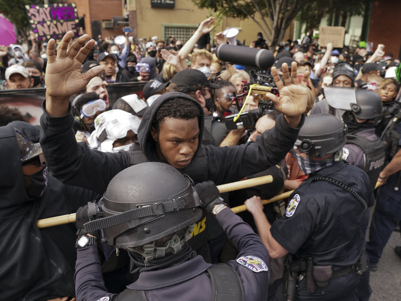

## Race in Louisville traffic stops (2015-2018)

### Introduction: 

* A dataset from the Stanford Open Policing Project contains details on several years' of police traffic stops in Louisville, Kentucky. I examined the data with the goal of determining whether race played a role in the outcomes of traffic stops in Louisville. As it did across the U.S., the issue of race and policing dominated headlines last year in Louisville, where the police shooting of Breonna Taylor in March was a factor in sparking nationwide protests. 

#### The data: 

https://openpolicing.stanford.edu/data/

The dataset contained details on more than 100,000 traffic stops over three years. Features included:

* Age, race and gender of people stopped 
* Age, race and gender of police officers who stopped them
* Location (latitude and longitude) of the stop
* Police division where the stop occurred
* The stated reason for the stop
* Whether the citizen was searched, frisked, given a citation

#### Among the questions asked and answered:

* Do Black citizens face a higher probability of being searched than white citizens? 
    -- Yes. 

* Are white officers or Black officers more likely to search a Black citizen?
    -- White officers.
    
* Are Black officers more likely to search a Black citizen or a white one?
    -- A Black one. 

* Are Latino officers more likely to search someone than a white officer?
    -- Yes. 

