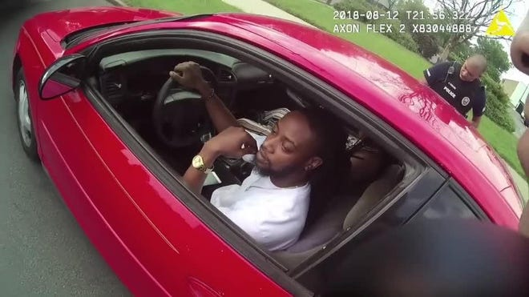
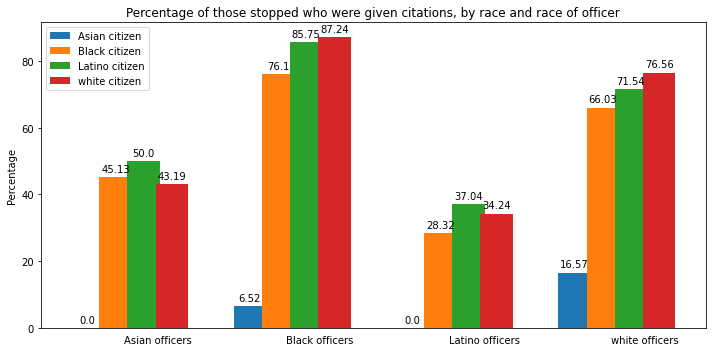
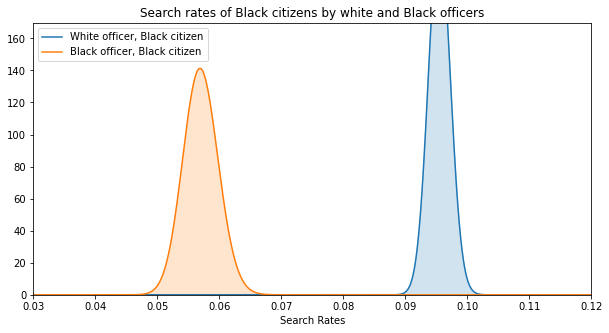
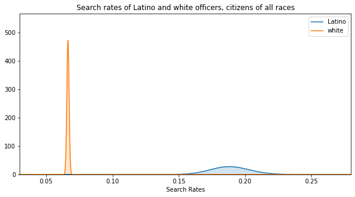
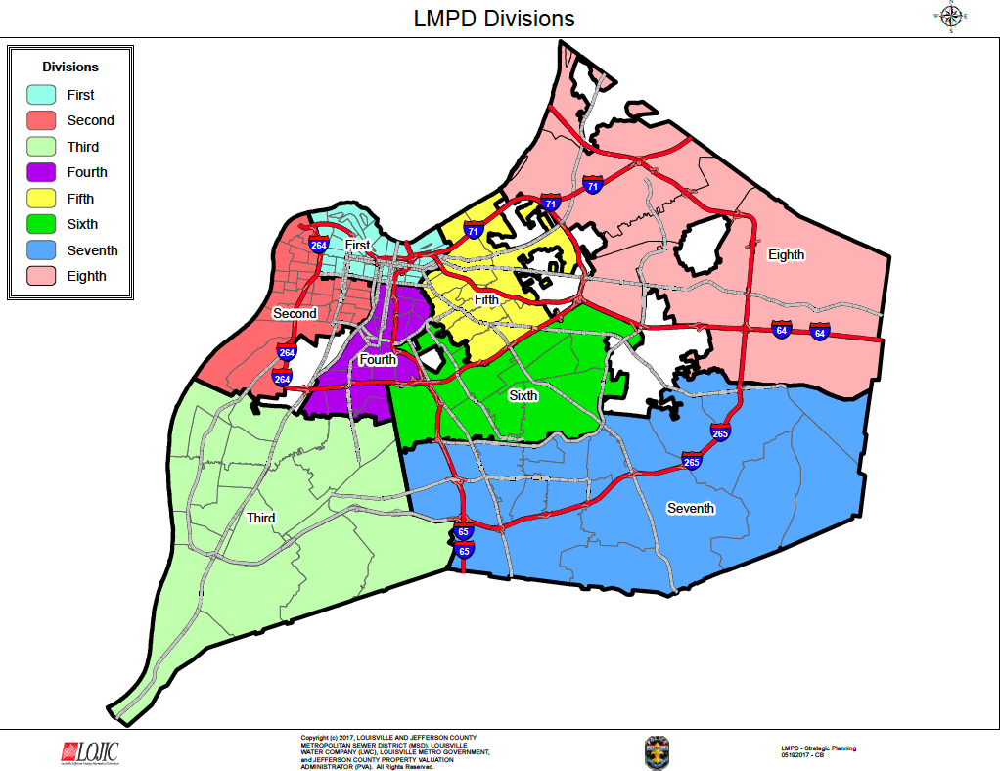
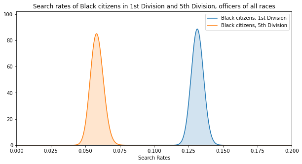

# Race in Louisville traffic stops (2015-2018)
&nbsp;
&nbsp;

&nbsp;
&nbsp;
## Introduction: 

* A dataset from the Stanford Open Policing Project contains details on several years' of police traffic stops in Louisville, Kentucky. I examined the data with the goal of determining whether race played a role in the outcomes of traffic stops in Louisville--and if so, what racial dynamics were at play. As it did across the U.S., the issue of race and policing dominated headlines last year in Louisville, where the police shooting of Breonna Taylor in March was a factor in sparking nationwide protests. 

&nbsp;
&nbsp;
## The data: 

https://openpolicing.stanford.edu/data/

The dataset contained details on more than 100,000 traffic stops over three years. Features included:

* Age, race and gender of people stopped 
* Age, race and gender of police officers who stopped them
* Location (latitude and longitude) of the stop
* Police division where the stop occurred
* The stated reason for the stop
* Whether the citizen was searched, frisked, given a citation

&nbsp;
&nbsp;
## Among the questions asked and answered:

* Do Black citizens face a higher probability of being searched than white citizens? 
    -- Yes. 

* Are white officers or Black officers more likely to search a Black citizen?
    -- White officers.
    
* Are Black officers more likely to search a Black citizen or a white one?
    -- A Black one. 

* Are Latino officers more likely to search someone than a white officer?
    -- Yes. 

&nbsp;
&nbsp;
&nbsp;
&nbsp;
## An overview of stops, searches and citations by race of citizens
* Blacks are overrepresented as a percentage of the population in stops, searches and citations.

* Whites, Latinos and Asians are underrepresented

&nbsp;
&nbsp;
&nbsp;
&nbsp;

&nbsp;
&nbsp;

* The percentage of Black motorists who were searched was nearly double that of whites. 

* But white citizens were given citations at a higher rate.

&nbsp;
&nbsp;

&nbsp;
&nbsp;
&nbsp;
&nbsp;
### The relative probabilities of Black and white citizens being searched

&nbsp;
* In 10,000 simulations, the probability that Blacks face a higher probability of being searched than whites: 1.0
&nbsp;
* Plotting the beta distributions of searches of Blacks and whites:  worlds apart

&nbsp;
&nbsp;
&nbsp;
&nbsp;

&nbsp;
&nbsp;
&nbsp;
&nbsp;

## What role might the officer's race play? 
&nbsp;
* Blacks were searched the highest percentage of the time by white, Black and Asian officers
&nbsp;
&nbsp;
* Latino officers searched whites the most often, followed by Latinos

&nbsp;
&nbsp;
&nbsp;
&nbsp;

&nbsp;
&nbsp;
&nbsp;
&nbsp;
* White and Latino citizens were given citations higher rates than Blacks by white, Latino and Black officers
&nbsp;
&nbsp;
* Latino officers appear far less aggressive in giving citations than in conducting searches

&nbsp;
&nbsp;
&nbsp;

&nbsp;
&nbsp;
&nbsp;
&nbsp;
### Do Black citizens face a higher probability of being searched by a white officer than a Black one?
&nbsp;
&nbsp;
* Ten thousand simulations found that the probability that Black citizens face higher probability of being searched by a white officer is 1.0
&nbsp;
&nbsp;
* Plotting the beta distributions of Black and white officers' searches of Black citizens illustrates the point.
&nbsp;
&nbsp;

&nbsp;
&nbsp;
&nbsp;
&nbsp;
### Are Black officers more likely to search Black citizens than white ones?
&nbsp;
&nbsp;
* Yes, again, the probability that a Black citizen faces a higher probability of being searched by a white officer is 1.0
&nbsp;
&nbsp;

&nbsp;
&nbsp;
&nbsp;
&nbsp;
### Do people stopped by Latino officers face a higher probability of being searched versus a white officer?
&nbsp;
&nbsp;
&nbsp;
&nbsp;
* In 10,000 simulations, the probability that the probability of being searched by a Latino officer is higher: 1.0
&nbsp;
&nbsp;
&nbsp;
&nbsp;
* Plotting the beta distribution of searches by Latino and white officers
&nbsp;
&nbsp;
&nbsp;
&nbsp;

&nbsp;
&nbsp;
&nbsp;
&nbsp;
## The role of geography 
&nbsp;
&nbsp;
&nbsp;
&nbsp;
#### Louisville ranks as the 30th most segregated city in the U.S., according to the Census Bureau. 
&nbsp;
&nbsp;
&nbsp;
&nbsp;

&nbsp;
&nbsp;
&nbsp;
&nbsp;

&nbsp;
&nbsp;
&nbsp;
&nbsp;

